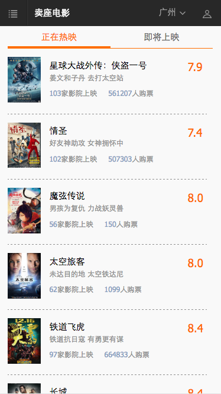
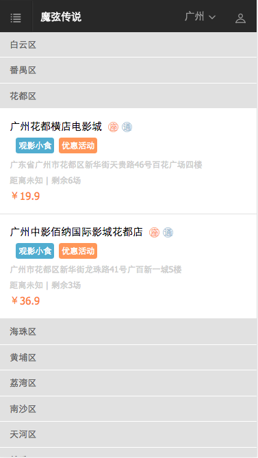

# Vue2实战：模仿卖座电影
> 使用Vue2.0全家桶仿制[卖座电影](http://m.maizuo.com/v4/?co=maizuo)
## 声明

该项目所用到的API均来自 [卖座电影](http://m.maizuo.com/v4/?co=maizuo) ，采用chrome 开发者工具分析出来的，只是为了得到数据进行排版练习，完全出于学习用途，并无恶意，请卖座电影官方海涵。

## 参考资料

vue2.0中文文档 : [https://vuefe.cn/v2/guide/](https://vuefe.cn/v2/guide/)

vue-router文档 : [https://router.vuejs.org/](https://router.vuejs.org/)

vuex文档 : [https://vuex.vuejs.org/](https://vuex.vuejs.org/)

轮播插件swiper : [https://github.com/surmon-china/vue-awesome-swiper](https://github.com/surmon-china/vue-awesome-swiper)

数据请求axios : [https://www.npmjs.com/package/axios](https://www.npmjs.com/package/axios)

项目参考 : [https://github.com/zhengguorong/maizuo/tree/master/vuexMaizuo2](https://github.com/zhengguorong/maizuo/tree/master/vuexMaizuo2)

## 项目结构


​	项目由vue-cli直接生成手脚架，之后调整`config/index.js`的build>assetsPublicPath为'./'，该属性跟打包后index.html的css和js的引入路径有关；开发过程中在build/dev-server.js配置相关代码以跨域

```javascript
app.use('/api',proxyMiddleware({
  target:'http://m.maizuo.com/v4',
  changeOrigin:true
}))
```

## 界面预览







> ps：只是模仿了以上页面，这几个页面感觉已经包括了vue的常用功能了，后面的页面则是跳去卖座电影的官网了；由于只是几个页面，故各个页面没有将相关的子项分离成组件，如果项目庞大，建议分离成组件形式

##### 最后，如果该demo对你学习vue有帮助，麻烦给个star，谢谢#####


## Build 

``` bash
# install dependencies
npm install

# serve with hot reload at localhost:8080
npm run dev

# build for production with minification
npm run build
```

For detailed explanation on how things work, checkout the [guide](http://vuejs-templates.github.io/webpack/) and [docs for vue-loader](http://vuejs.github.io/vue-loader).
